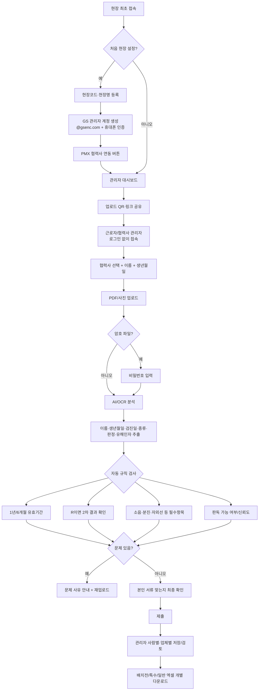

# GS Health Check Prototype

GS건설 현장에서 **배치전건강진단 / 특수건강진단 / 일반건강검진** 서류를 근로자·협력사 관리자가 업로드하고, GS 관리자가 사람별·업체별로 검토한 뒤 PMX 업로드용 엑셀을 내려받는 흐름을 검증하기 위한 프로토타입입니다.

## 구현된 화면/기능

- 첫 화면: `처음 현장 설정 / GS 관리자 로그인 / 건강진단 서류 업로드`
- 관리자 초기 설정: 현장 코드·현장명·관리자명·이메일·비밀번호·휴대폰 인증 UI
- `@gsenc.com` 이메일만 통과하는 프론트 검증
- PMX 협력사 API 연결 버튼 자리(준비중)
- 관리자 대시보드: 업로드 현황, 검토 필요, 만 63세 이상, 협력사 수
- 업체/근로자/검진종류 검색·필터
- 업로드 링크 + QR 코드
- 검토 기준 설정: 63세 미만 12개월, 63세 이상 6개월, R 2차 결과, 유해인자 체크
- 근로자 업로드: 로그인 없이 회사 → 이름 → 생년월일 → 검진종류 → 파일/사진 → 비밀번호(선택) → 분석 확인 → 제출
- 근로자 화면 한국어 / 中文 / English
- 모바일 카메라 촬영 input
- 배치전/특수/일반 결과를 각각 PMX 업로드용 `.xlsx`로 다운로드
- 제출 전 본인 서류가 맞는지 재확인
- 만 63세 이상 대상 별도 목록

## 흐름도



## 실제 서비스용 권장 데이터 구조

- `sites`: 현장 코드, 현장명, 검토 규칙
- `admins`: GS 관리자, 이메일, 인증 상태, 역할
- `companies`: 협력사 코드/명, PMX 동기화 시각
- `workers`: 이름, 생년월일, 협력사, PMX 근로자 ID
- `documents`: 원본 파일, 업로드 시각, 암호파일 여부, 업로더 유형
- `exams`: 검진종류, 검진일, 결과코드, 비고, 유해인자, 2차 검진 여부
- `analysis_runs`: OCR/AI 추출값, 신뢰도, 분석 모델/버전
- `review_logs`: 누가 언제 어떤 값으로 수정·승인했는지 감사 로그

## 중요: 현재는 UI/흐름 프로토타입

현재 분석 화면은 실제 의료문서를 OCR/AI로 읽는 서버 기능이 아니라 **프론트엔드 시뮬레이션**입니다. 실서비스 연결 순서는 아래를 권장합니다.

1. 업로드 파일을 암호화 스토리지에 저장
2. 암호 PDF라면 비밀번호 입력 요청 후 서버에서 해제
3. OCR + 문서 구조화
4. 규칙 엔진 적용
5. 낮은 판독 신뢰도/충돌값은 관리자 검토 큐로 이동
6. 원본·자동판독값·관리자 수정 이력을 감사로그로 기록

## 실행

```bash
npm install
npm run dev
```

브라우저에서 `http://localhost:3000` 접속.

## 다음 개발 순서

1. 실제 DB/파일 스토리지 연결
2. 관리자 인증 + 현장별 권한 분리
3. OCR/AI 분석 API 연결
4. 실제 엑셀 양식과 1:1 필드 매핑 검증
5. PMX 협력사 API 연결
6. SMS 본인인증 연결
7. 건강정보 보존기간/파기/다운로드 권한 정책 확정
